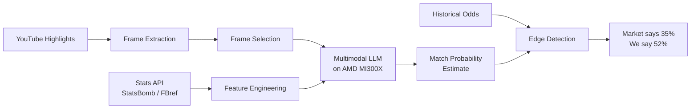

# Offsides

<p align="center">
  
</p>

A multimodal AI system that analyzes UEFA Champions League match footage alongside statistical data to detect when sports prediction markets are mispriced. Using Llama 3.2 Vision running on AMD MI300X GPUs, it extracts tactical signals from video frames — defensive shape, pressing intensity, transition patterns — that traditional stats-based models miss, then compares its probability estimates against market odds to surface edges the crowd hasn't priced in yet.

**Track 3: Vision & Multimodal AI** | AMD Developer Hackathon 2026

## Architecture



## Tech Stack

| Component | Technology |
|-----------|-----------|
| Compute | AMD Instinct MI300X (192GB HBM3) via AMD Developer Cloud |
| Model | Llama 3.2 Vision on ROCm |
| Serving | vLLM / Hugging Face Transformers + Accelerate |
| Stats data | StatsBomb (event-level), FBref (aggregate), API-Football |
| Odds data | Historical betting odds via Odds-portal |
| Video | YouTube UEFA Champions League highlights |
| Frame extraction | OpenCV |
| Language | Python 3.12 |
| Tests | pytest |

## Getting Started

### Prerequisites

- Python 3.12+
- ~25 GB disk space (for highlight videos)
- AMD Developer Cloud account (for GPU inference)

### Setup

```bash
git clone https://github.com/MichaelPaonam/offsides.git
cd offsides

# Create virtual environment
python3 -m venv venv
source venv/bin/activate

# Install dependencies
pip install yt-dlp
# pip install -r requirements.txt  (TODO: add during development)
```

### Download Match Highlights

```bash
# 1. Generate fixture list (313 UCL matches across 2023-24 and 2024-25 seasons)
python scripts/generate_match_list.py

# 2. Auto-fill YouTube URLs (~16 min unattended)
python scripts/autofill_urls.py

# 3. Spot-check the CSV, then download videos (~2-4 hrs unattended)
python scripts/download_highlights.py
```

See [scripts/README.md](scripts/README.md) for full details.

### Run the Pipeline

```bash
# TODO: implement during development phase
python offsides.py --match "Barcelona vs PSG" --date "2024-04-10"
```

## Project Structure

```
.
├── scripts/                    # Data collection scripts
│   ├── generate_match_list.py  # Generate UCL fixture CSV
│   ├── autofill_urls.py        # Auto-fill YouTube URLs via yt-dlp search
│   ├── download_highlights.py  # Download highlight videos at 720p
│   └── README.md               # Script usage docs
├── data/
│   ├── match_urls/             # Fixture CSVs with YouTube URLs
│   └── highlights/             # Downloaded videos (gitignored)
├── docs/
│   ├── project-plan.md         # Timeline, milestones, checkpoints
│   ├── research-plan.md        # 2-day research phase breakdown
│   ├── project-description.md  # Pitch and description for judges
│   └── storyline.md            # Full project narrative
└── venv/                       # Python virtual environment (gitignored)
```

## How It Works

1. **Ingest** — Pull match highlight clips + structured stats (xG, pressing data, form, fitness proxies) + historical market odds
2. **Extract** — Sample key frames from video that reveal tactical shape
3. **Analyze** — Feed frames to Llama 3.2 Vision on AMD MI300X. Ask targeted tactical questions: defensive line shape, midfield compactness, pressing structure
4. **Aggregate** — Combine visual tactical insights with statistical features into a unified match assessment
5. **Price** — Generate win/draw/loss probability
6. **Compare** — Overlay against market odds, flag discrepancies as potential edges

## Key Design Decisions

| Decision | Choice | Rationale |
|----------|--------|-----------|
| No fine-tuning | Base model + prompt engineering | No labeled tactical data; fine-tuning would consume the entire timeline |
| No ball/player tracking | Vision-language model for holistic scene interpretation | Tracking is solved by others (StatsBomb); our value is tactical *interpretation* |
| Highlights not full matches | YouTube highlights are legal and sufficient | Tactical shape is visible in frames; full matches are copyrighted |
| Stats for fitness | Minutes played, pressing dropoff, rotation patterns | Highlights don't show off-ball fatigue |
| CLI-first | Terminal output with clear results | Judges care about the pipeline working, not a polished UI |

## Data Sources

| Source | What it provides | Access |
|--------|-----------------|--------|
| [StatsBomb Open Data](https://github.com/statsbomb/open-data) | Event-level match data (passes, shots, pressures with x/y coords) | Free (GitHub) |
| [FBref](https://fbref.com) | Aggregate match stats, xG, pressing data | Free (web) |
| [API-Football](https://www.api-football.com) | Fixtures, lineups, live stats | Free tier (100 req/day) |
| [Odds-portal](https://www.oddsportal.com) | Historical betting odds | Free (web) |
| [UEFA YouTube](https://www.youtube.com/@ChampionsLeague) | Official highlight clips | Free |

## Contributing

1. Check `docs/project-plan.md` for current phase and milestones
2. Run scripts locally — GPU inference happens on AMD Developer Cloud only
3. Download highlights locally, upload only extracted frames to cloud VM

## Why AMD

The MI300X's 192GB unified HBM3 memory fits the 90B parameter Llama 3.2 Vision model on a single device — no model sharding required. ROCm provides native PyTorch compatibility, so the pipeline runs without CUDA-specific rewrites.

## License

TBD
