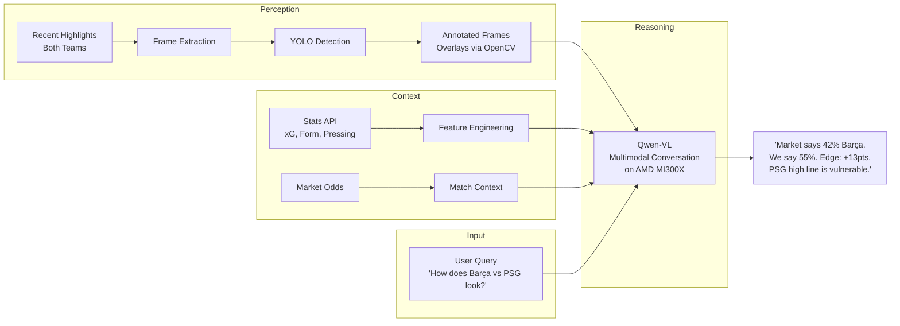

# Offsides

<p align="center">
  
</p>

A multimodal conversational assistant for sports prediction markets. Ask about any upcoming UEFA Champions League match — Offsides analyzes recent footage of both teams using YOLO + Qwen-VL on AMD MI300X GPUs, extracts tactical signals the market hasn't priced in (defensive shape deterioration, pressing intensity trends, transition vulnerabilities), and tells you where it disagrees with the odds.

**Track 3: Vision & Multimodal AI** | AMD Developer Hackathon 2026

## Architecture



## Tech Stack

| Component | Technology |
|-----------|-----------|
| Compute | AMD Instinct MI300X (192GB HBM3) via AMD Developer Cloud |
| Cloud Image | vLLM 0.17.1 on ROCm (Ubuntu 24.04) |
| Object Detection | YOLO (player/ball tracking, formations) |
| Frame Annotation | OpenCV (render YOLO detections onto frames) |
| Reasoning Model | Qwen-VL on ROCm (7B dev / 72B final) |
| Model Serving | vLLM on ROCm |
| Demo | Hugging Face Spaces (Gradio) |
| Stats data | StatsBomb (event-level), FBref (aggregate) |
| Odds data | Historical betting odds via Odds-portal |
| Video | YouTube UEFA Champions League highlights |
| Language | Python 3.12 |
| Tests | pytest |

## Getting Started

### Prerequisites

- Python 3.12+
- ~25 GB disk space (for highlight videos)
- AMD Developer Cloud account (for GPU inference)

### Setup

```bash
git clone https://github.com/MichaelPaonam/offsides.git
cd offsides

# Create virtual environment
python3 -m venv venv
source venv/bin/activate

# Install dependencies
pip install -r requirements.txt
```

### Run the Demo (local)

```bash
# Launch Gradio app (displays pre-computed results)
python app.py
# Open http://localhost:7860
```

### Run VLM Inference (requires AMD GPU)

See [docs/cloud_inference.md](docs/cloud_inference.md) for full setup.

```bash
# Quick start (with SSH tunnel to AMD MI300X droplet)
ssh -i ~/.ssh/id_ed25519_amd -f -N -L 8000:localhost:8000 root@<droplet-ip>
VLM_MODEL="Qwen/Qwen2.5-VL-72B-Instruct" python3 scripts/vlm_inference.py
```

### Download Match Highlights (full pipeline)

```bash
# 1. Generate fixture list (313 UCL matches across 2023-24 and 2024-25 seasons)
python scripts/generate_match_list.py

# 2. Auto-fill YouTube URLs (~16 min unattended)
python scripts/autofill_urls.py

# 3. Download videos (~2-4 hrs unattended)
python scripts/download_highlights.py

# 4. Extract frames, detect players, annotate
python scripts/extract_frames.py
python scripts/detect_players.py
python scripts/annotate_frames.py
```

### GPU Cloud Setup

See [docs/cloud_inference.md](docs/cloud_inference.md) for detailed instructions.

```bash
# SSH into AMD MI300X droplet
ssh -i ~/.ssh/id_ed25519_amd root@<droplet-ip>

# Start vLLM with Qwen-VL 72B
docker run -d --name vllm-server \
  --device=/dev/kfd --device=/dev/dri --group-add video \
  -p 8000:8000 --shm-size=16g \
  rocm/vllm:latest \
  vllm serve Qwen/Qwen2.5-VL-72B-Instruct --dtype auto --max-model-len 8192 --port 8000 --host 0.0.0.0
```

## Project Structure

```
.
├── app.py                         # Gradio demo app (HF Space)
├── scripts/
│   ├── generate_match_list.py     # Generate UCL fixture CSV
│   ├── autofill_urls.py           # Auto-fill YouTube URLs via yt-dlp search
│   ├── download_highlights.py     # Download highlight videos at 720p
│   ├── extract_frames.py          # Scene-detection frame extraction
│   ├── detect_players.py          # YOLO player/ball detection + ByteTrack
│   ├── annotate_frames.py         # Team color assignment + tactical overlays
│   ├── vlm_inference.py           # Qwen-VL multimodal inference via vLLM
│   └── manifest.py                # Video metadata helper
├── data/
│   ├── demo_matches.json          # 5 curated UCL upset matches
│   ├── team_kits.json             # HSV color definitions for 50 UCL teams
│   ├── vlm_results/               # VLM inference output
│   │   ├── results.json           # Structured assessments (72B)
│   │   └── frames/                # Annotated frames used by VLM
│   ├── frames/                    # Full pipeline output (gitignored)
│   └── highlights/                # Downloaded videos (gitignored)
├── docs/
│   └── cloud_inference.md         # AMD GPU cloud runbook
├── notebooks/                     # Validation notebooks
├── requirements.txt
└── README.md
```

## How It Works

1. **Query** — User asks about a match ("How does Barcelona vs PSG look for Tuesday?")
2. **Ingest** — System pulls recent highlights for both teams (last 3-5 matches) + stats + market odds
3. **Extract** — Sample key frames from recent footage
4. **Detect** — YOLO extracts player/ball positions, formation shapes, defensive line height
5. **Annotate** — Render detections onto original frames (bounding boxes, defensive line, compactness ellipse, formation skeleton)
6. **Reason** — Qwen-VL receives annotated frames + stats + odds, produces tactical assessment via multimodal conversation
7. **Respond** — Natural language answer: probability, edge vs market, reasoning, visual evidence from frames

Users can ask follow-up questions ("What specifically is wrong with PSG's defense?") — the VLM references annotated frames in its responses.

## Results

Validated on 5 UCL knockout matches where the market-favored outcome lost. The VLM correctly identified the edge on the actual winning outcome in **3 out of 5 matches**.

| Match | Stage | Market Favorite | VLM Edge | Actual Result | Correct? |
|-------|-------|----------------|----------|---------------|----------|
| Dortmund vs PSG | SF 2nd leg | PSG (56%) | **Dortmund +9pp** | Dortmund 1-0 | ✓ |
| Dortmund vs Atletico | QF 2nd leg | Atletico (1st leg lead) | **Dortmund +5pp** | Dortmund 4-2 | ✓ |
| PSG vs Barcelona | QF 2nd leg | Barcelona (agg lead) | **PSG +4pp** | PSG 4-1 | ✓ |
| Man City vs Real Madrid | QF 2nd leg | Man City (55%) | Man City +3pp | Draw (1-1, pens) | ✗ |
| Atletico vs Inter | R16 2nd leg | Inter (1st leg lead) | Draw +2pp | Atletico 2-1 | ✗ |

**Key finding:** In the 3 correct cases, the VLM identified tactical signals (defensive compactness, transition speed, pressing intensity) that were visible in annotated frames but not captured in traditional stats — the exact kind of signal prediction markets discount.

**Model:** Qwen-VL 72B on AMD MI300X (single GPU, 192GB HBM3) via vLLM on ROCm. Inference time: ~10-18s per match.

## Key Design Decisions

| Decision | Choice | Rationale |
|----------|--------|-----------|
| Two-stage architecture | YOLO (perception) → Annotate → VLM (reasoning) | VLMs can't do precise tracking; YOLO can't interpret. Annotation bridges both — VLM sees the scene with spatial data overlaid |
| Prospective mode | Analyze recent form of both teams pre-match | Edge is only actionable before kickoff — this is how market users seek alpha |
| Conversational interface | Multi-turn natural language Q&A | Track 3 asks for multimodal conversational assistants; users ask tactical questions, get reasoned answers |
| Qwen-VL over Llama Vision | Qwen-based VLAs for reasoning | Stronger reasoning support, mentor-recommended, ROCm compatible |
| No fine-tuning | Base model + prompt engineering | No labeled tactical data; fine-tuning would consume the entire timeline |
| Highlights not full matches | YouTube highlights are legal and sufficient | Tactical shape visible in frames; full matches are copyrighted |
| Stats for fitness | Minutes played, pressing dropoff, rotation patterns | Highlights don't show off-ball fatigue |
| HF Space as submission | Gradio app on Hugging Face Spaces | Required deliverable (submit Space link on lablab.ai) + most likes wins HF Category Prize |
| CLI + chatbot | Terminal output + natural language queries | Judges can ask "Was Barcelona struggling in midfield?" and get reasoned answers |

## Data Sources

| Source | What it provides | Access |
|--------|-----------------|--------|
| [StatsBomb Open Data](https://github.com/statsbomb/open-data) | Event-level match data (passes, shots, pressures with x/y coords) | Free (GitHub) |
| [FBref](https://fbref.com) | Aggregate match stats, xG, pressing data | Free (web) |
| [API-Football](https://www.api-football.com) | Fixtures, lineups for upcoming matches | Free tier (100 req/day) — optional, not on critical path |
| [Odds-portal](https://www.oddsportal.com) | Historical betting odds | Free (web) |
| [UEFA YouTube](https://www.youtube.com/@ChampionsLeague) | Official highlight clips | Free |

## Contributing

1. Run scripts locally — GPU inference happens on AMD Developer Cloud only
2. Download highlights locally, upload only extracted frames to cloud VM

## Why AMD

The MI300X's 192GB unified HBM3 memory fits Qwen-VL 72B on a single device — no model sharding required. This enables real-time multimodal conversation: the VLM processes annotated frames (4-6 images per team) alongside stats in a single context window, and users can ask follow-up questions without latency from cross-device communication. ROCm provides native PyTorch compatibility — our pipeline runs identically to CUDA with zero code changes (just a different pip install URL).

## License

MIT
