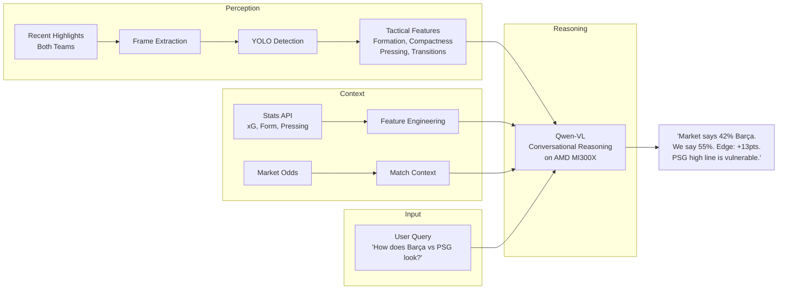

# Offsides

<p align="center">
  
</p>

A multimodal conversational assistant for sports prediction markets. Ask about any upcoming UEFA Champions League match — Offsides analyzes recent footage of both teams using YOLO + Qwen-VL on AMD MI300X GPUs, extracts tactical signals the market hasn't priced in (defensive shape deterioration, pressing intensity trends, transition vulnerabilities), and tells you where it disagrees with the odds.

**Track 3: Vision & Multimodal AI** | AMD Developer Hackathon 2026

## Architecture



## Tech Stack

| Component | Technology |
|-----------|-----------|
| Compute | AMD Instinct MI300X (192GB HBM3) via AMD Developer Cloud |
| Object Detection | YOLO (player/ball tracking, formations) |
| Reasoning Model | Qwen-VL on ROCm |
| Serving | vLLM / Hugging Face Transformers + Accelerate |
| Demo | Hugging Face Spaces (Gradio) |
| Stats data | StatsBomb (event-level), FBref (aggregate), API-Football |
| Odds data | Historical betting odds via Odds-portal |
| Video | YouTube UEFA Champions League highlights |
| Frame extraction | OpenCV |
| Language | Python 3.12 |
| Tests | pytest |

## Getting Started

### Prerequisites

- Python 3.12+
- ~25 GB disk space (for highlight videos)
- AMD Developer Cloud account (for GPU inference)

### Setup

```bash
git clone https://github.com/MichaelPaonam/offsides.git
cd offsides

# Create virtual environment
python3 -m venv venv
source venv/bin/activate

# Install dependencies
pip install yt-dlp
# pip install -r requirements.txt  (TODO: add during development)
```

### Download Match Highlights

```bash
# 1. Generate fixture list (313 UCL matches across 2023-24 and 2024-25 seasons)
python scripts/generate_match_list.py

# 2. Auto-fill YouTube URLs (~16 min unattended)
python scripts/autofill_urls.py

# 3. Spot-check the CSV, then download videos (~2-4 hrs unattended)
python scripts/download_highlights.py
```

See [scripts/README.md](scripts/README.md) for full details.

### Run the Pipeline

```bash
# Ask about an upcoming match
python offsides.py "How does Barcelona vs PSG look for Tuesday?"

# Ask about a past match (retrospective validation)
python offsides.py "Was the market wrong on Inter vs Atletico, March 2024?"

# Interactive conversation mode
python offsides.py --chat
> How does Barcelona vs PSG look?
> What's wrong with PSG's defense specifically?
> Show me the pressing data from their last 3 matches
```

## Project Structure

```
.
├── scripts/                    # Data collection scripts
│   ├── generate_match_list.py  # Generate UCL fixture CSV
│   ├── autofill_urls.py        # Auto-fill YouTube URLs via yt-dlp search
│   ├── download_highlights.py  # Download highlight videos at 720p
│   └── README.md               # Script usage docs
├── data/
│   ├── match_urls/             # Fixture CSVs with YouTube URLs
│   └── highlights/             # Downloaded videos (gitignored)
├── offsides-logo.png           # Project logo
└── venv/                       # Python virtual environment (gitignored)
```

## How It Works

1. **Query** — User asks about a match ("How does Barcelona vs PSG look for Tuesday?")
2. **Ingest** — System pulls recent highlights for both teams (last 3-5 matches) + stats + market odds
3. **Extract** — Sample key frames from recent footage
4. **Detect** — YOLO extracts player/ball positions, formation shapes, defensive line height
5. **Map** — Convert detections into tactical metrics and trends (compactness dropping, pressing weakening)
6. **Reason** — Qwen-VL reasons over tactical features + stats + odds, produces assessment
7. **Respond** — Natural language answer: probability, edge vs market, reasoning, supporting evidence

Users can ask follow-up questions ("What specifically is wrong with PSG's defense?") for multi-turn conversation.

## Key Design Decisions

| Decision | Choice | Rationale |
|----------|--------|-----------|
| Two-stage architecture | YOLO (perception) + VLM (reasoning) | VLMs are bad at precise tracking; YOLO is bad at interpretation. Use each for its strength |
| Prospective mode | Analyze recent form of both teams pre-match | Edge is only actionable before kickoff — this is how market users seek alpha |
| Conversational interface | Multi-turn natural language Q&A | Track 3 asks for multimodal conversational assistants; users ask tactical questions, get reasoned answers |
| Qwen-VL over Llama Vision | Qwen-based VLAs for reasoning | Stronger reasoning support, mentor-recommended, ROCm compatible |
| No fine-tuning | Base model + prompt engineering | No labeled tactical data; fine-tuning would consume the entire timeline |
| Highlights not full matches | YouTube highlights are legal and sufficient | Tactical shape visible in frames; full matches are copyrighted |
| Stats for fitness | Minutes played, pressing dropoff, rotation patterns | Highlights don't show off-ball fatigue |
| HF Space as demo | Gradio app on Hugging Face Spaces | Prize opportunity (most likes wins), interactive, shareable URL for judges |
| CLI + chatbot | Terminal output + natural language queries | Judges can ask "Was Barcelona struggling in midfield?" and get reasoned answers |

## Data Sources

| Source | What it provides | Access |
|--------|-----------------|--------|
| [StatsBomb Open Data](https://github.com/statsbomb/open-data) | Event-level match data (passes, shots, pressures with x/y coords) | Free (GitHub) |
| [FBref](https://fbref.com) | Aggregate match stats, xG, pressing data | Free (web) |
| [API-Football](https://www.api-football.com) | Fixtures, lineups, live stats | Free tier (100 req/day) |
| [Odds-portal](https://www.oddsportal.com) | Historical betting odds | Free (web) |
| [UEFA YouTube](https://www.youtube.com/@ChampionsLeague) | Official highlight clips | Free |

## Contributing

1. Run scripts locally — GPU inference happens on AMD Developer Cloud only
2. Download highlights locally, upload only extracted frames to cloud VM

## Why AMD

The MI300X's 192GB unified HBM3 memory fits Qwen-VL 72B on a single device — no model sharding required. This enables real-time conversational inference where users can ask follow-up questions without latency spikes from cross-device communication. ROCm provides native PyTorch compatibility, so the pipeline runs without CUDA-specific rewrites.

## License

MIT
